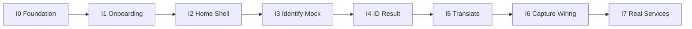
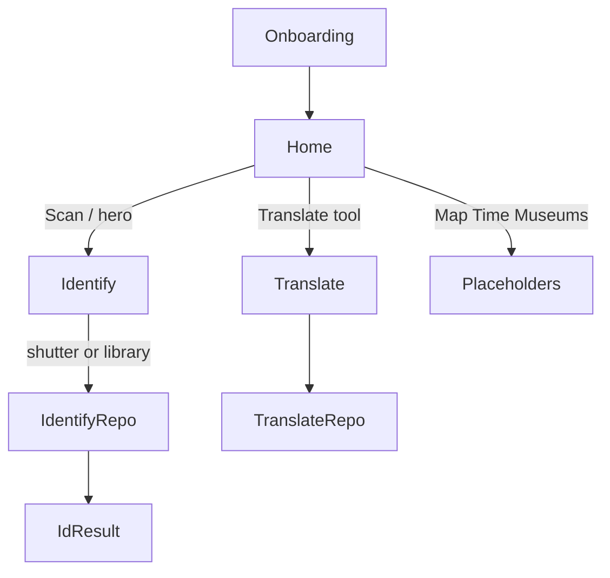

# Strata Iterative Screen Development Plan

Iterative Flutter plan to build Strata’s five mockup screens (Onboarding → Home shell → Identify → ID Result → Paleo Translate) from static mock UI to wired mock data, then swappable real services—without building Dig Map / Timeline / Museums beyond navigable placeholders in this phase.

## Progress


| Iteration           | Status    |
| ------------------- | --------- |
| 0 — Foundation      | Completed |
| 1 — Onboarding      | Completed |
| 2 — Home shell      | Completed |
| 3 — Identify mock   | Completed |
| 4 — ID Result       | Completed |
| 5 — Paleo Translate | Completed |
| 6 — Capture wiring  | Completed |
| 7 — Real services   | Pending   |


## Current state

`[dino_app](../dino_app)` started as a stock Flutter counter app. Iterations 0–6 delivered theming, routing, onboarding, Home shell, Identify + ID Result, Paleo Translate, and gallery/camera capture wired to mock identification. Real APIs remain for Iteration 7.

**Scope for this plan:** the five mockups (Onboarding, Home, Identify, ID Result, Paleo Translate), plus a bottom-nav shell so they connect. Dig Map, Deep Time, Museums, and At Risk get **placeholder routes** only (tappable from Home, simple “Coming soon” screens). Backend stays **local mock JSON + repository interfaces** so real APIs can swap in later without rewriting screens.

**Default stack decisions:**

- Navigation: `go_router`
- Fonts: `google_fonts` (serif display + sans UI) until custom brand fonts are added
- Theme: shared `StrataTheme` tokens matching mockups (cream `#F7F4EF`, orange/gold CTAs, teal translate accent, dark camera chrome)
- State: simple `ChangeNotifier` / inherited repositories first (no Riverpod/Bloc until needed)
- Identify camera: mock overlay first; then `image_picker` / `camera` for capture; AI behind an `IdentifyRepository` interface


## Target folder structure

```
dino_app/lib/
  main.dart
  app.dart
  theme/strata_theme.dart
  router/app_router.dart
  models/          # FossilMatch, IdResult, SiteSummary, GlossaryTerm, ...
  data/
    mock/          # JSON + Dart seed data
    repositories/  # interfaces + Mock* implementations
  screens/
    onboarding/
    home/
    identify/
    id_result/
    translate/
    placeholders/  # map, timeline, museums, at_risk
  widgets/         # shared: StrataBottomNav, badges, gradient buttons
assets/
  images/          # hero, fossil thumbs, logo (from mock assets or placeholders)
  data/            # fossils.json, translate_sample.json
```


## Iteration roadmap

Each iteration should be a small, reviewable slice: ship UI → wire mock data → replace one repository with a real source.




### Iteration 0 — Foundation (½–1 day) — completed

- Replace counter app with `MaterialApp.router`, app title **Strata**
- Add `[strata_theme.dart](../dino_app/lib/theme/strata_theme.dart)`: colors, radii, text styles (serif headlines / sans body)
- Add `go_router` routes: `/onboarding`, `/home`, `/identify`, `/id-result`, `/translate`, plus placeholders
- Register assets folder in `[pubspec.yaml](../dino_app/pubspec.yaml)`; drop in logo + a few fossil placeholder images
- Shared widgets: orange gradient CTA, glass/dark circular icon button, confidence pill

**Done when:** app launches to a blank scaffold per route with correct theme colors.

### Iteration 1 — Onboarding mock UI — completed

Match mock: full-bleed dino/desert hero, Strata logo lockup, “THE PALEONTOLOGY FIELD COMPANION” badge, serif headline *Read the record of life on Earth.*, feature chips (Identify / Dig Map / Deep Time), **Get Started →**, Sign in link (UI only).

- Static layout; chips navigate to `/identify` or placeholders
- **Get Started** → `/home` (persist a `shared_preferences` flag `hasOnboarded` in a later tiny follow-up if desired)

**Done when:** screen looks like the mock on phone/web; Get Started opens Home.

### Iteration 2 — Home + bottom nav shell — completed

Match mock: greeting, AI Identify hero card, 5-tool icon row, Recently identified horizontal list, Near You card, custom bottom bar (Home / Map / **Scan FAB** / Time / Museums).

- Build reusable widgets: `GradientHeroCard`, `ToolIconGrid`, `RecentMatchCard`, `NearYouCard`, `StrataBottomNav`
- Feed UI from `MockFossilRepository` / `MockSiteRepository` (hardcoded lists first)
- Wire: Scan FAB + hero CTA → `/identify`; tool icons → translate or placeholders; “See all” can be a stub list screen

**Done when:** Home matches composition; nav and primary CTAs navigate correctly with mock content.

### Iteration 3 — Identify camera mock UI — completed

Dark full-screen overlay: close, title pill, flash, orange focus brackets + scan line, status badges, Library / Photo / Live ID mode selector, gallery thumb, shutter, flip.

- Use a **static specimen image** as the “camera feed” (works on Edge/web without camera permissions)
- Shutter navigates to `/id-result` with a fixed mock specimen id
- Mode selector is visual state only (Photo active)

**Done when:** Identify looks like the mock and shutter opens ID Result.

### Iteration 4 — ID Result mock → mock data — completed

Header specimen image, overlapping result card (confidence, genus, progress bar), alternatives, AI tip callout, taxonomy chips, quick-facts row, **View full profile** + bookmark.

- Models: `IdCandidate`, `IdResult`, `TaxonFact`
- Load from `assets/data/id_results.json` via `IdentifyRepository.getMockResult(imageId)`
- “View full profile” → placeholder species profile (name + facts) for now

**Done when:** Result screen is data-driven from JSON; changing JSON updates the UI without layout rewrites.

### Iteration 5 — Paleo Translate mock → mock data — completed

Header, language swap card, source abstract, teal **Translate (Paleo mode)** button, result with highlighted terms, glossary cards.

- Models: `TranslateRequest`, `TranslateResult`, `GlossaryTerm`
- Mock repo returns the German→English sample from the mockup (and 1–2 extra canned pairs)
- Copy button via `Clipboard`; TTS/history icons can be no-ops initially

**Done when:** tapping Translate shows result + glossary from mock repo; swap languages toggles UI state.

### Iteration 6 — Capture & gallery wiring (still mock AI) — completed

- Add `image_picker` (and `camera` on mobile when ready): Library + shutter use real pick/capture
- On web/Edge: keep image_picker gallery path; camera may stay mocked
- Pass picked image path/bytes into Identify screen preview; still call **mock** `IdentifyRepository.identify(bytes)` that returns canned `IdResult` (optionally pick result by simple heuristics later)

**Done when:** user can pick a photo and land on ID Result with mock candidates; no real model yet.

### Iteration 7 — Real data adapters (one service at a time)

> **Detailed Identify + species facts plan:** [iteration-7-identify-roadmap.md](./iteration-7-identify-roadmap.md) (versions 0.1 → 1.0). Prioritize Identify and PBDB species facts first; Sites, Translate API, and Auth stay later.

Keep screens unchanged; swap repository implementations:


| Feature          | Interface stays       | First real source (suggested)                                       |
| ---------------- | --------------------- | ------------------------------------------------------------------- |
| Identify         | `IdentifyRepository`  | Vision API or custom ML endpoint returning ranked taxa + confidence |
| Species/facts    | `TaxonRepository`     | Static curated JSON → later Firestore/GBIF/Paleobiology Database    |
| Sites (Near You) | `SiteRepository`      | Local GeoJSON of public sites → maps SDK later                      |
| Translate        | `TranslateRepository` | LLM API with paleo system prompt + glossary dictionary              |
| Auth / Sign in   | deferred              | Firebase Auth or skip until needed                                  |


**Done when:** at least one live path (Identify + species facts per the version roadmap) works end-to-end; others remain mock.

## Screen → data flow (after Iteration 4–5)




## Design tokens (from mockups)

- Background cream: ~`#F7F4EF`
- Primary CTA gradient: orange → gold (`#F2994A` → `#F2C94C`)
- Translate teal: ~`#1B8E7D`
- Confidence/success: teal-green
- Camera chrome: translucent black + orange brackets
- Radii: large (cards ~16–24, pills ~999, FAB square with rounded corners)


## Out of scope for this plan (later phases)

- Full Dig Map with permits / Camp Prep
- Deep Time timeline with era scrubbing
- Museums detail experiences
- **At Risk tab** — replace the placeholder with a conservation explorer that surfaces living species at risk of extinction (status, habitat, threats), bridging extinct taxa from the fossil modules to modern biodiversity
- Real auth (“Sign in”)
- Live ID streaming inference
- Species “full profile” deep content beyond a stub


## Suggested cadence

Treat **Iterations 0–2** as the first vertical slice (branded, navigable shell). **3–5** complete the mockup set with mock data. **6–7** move toward production data one repository at a time. Prefer merging after each iteration so the running app always stays demoable.