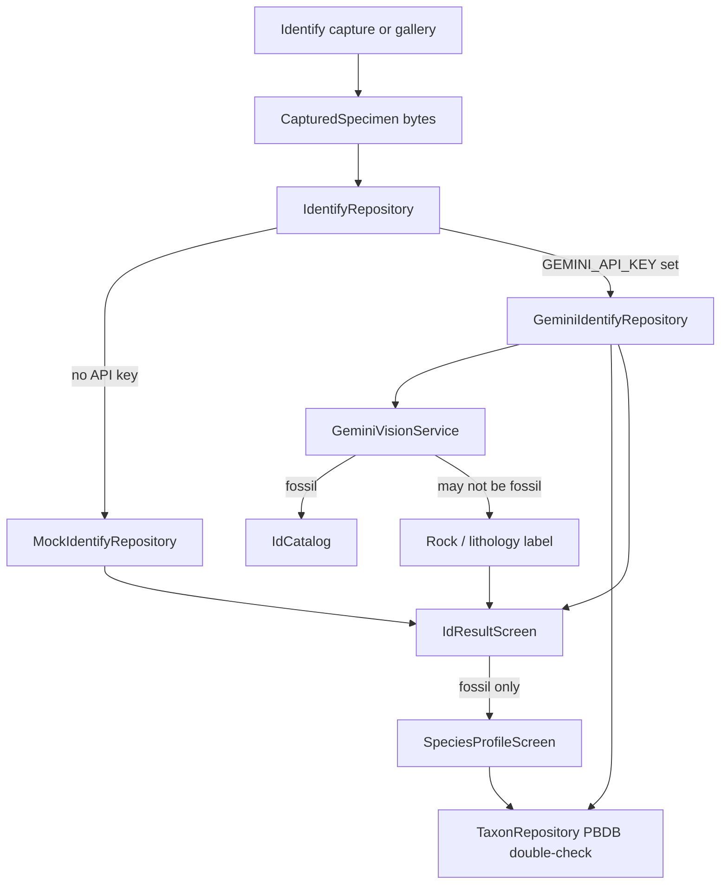
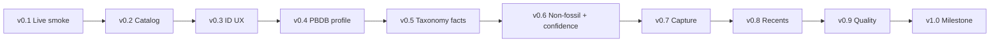

# Iteration 7 — Identify & Species Facts Roadmap

Versioned plan to turn Strata’s mock Identify path into a reliable **photo → (ranked fossil match | honest “may not be a fossil” + rock type) → species facts** experience. This expands Iteration 7 from [app-development-plan.md](./app-development-plan.md), prioritizing Identify and species facts first.

**Versions:** 0.1 → 0.2 → … → 1.0  
Each version adds **one feature**, is **fully tested**, and **builds on** the previous version.

---

## Goal

Ship a demoable end-to-end flow:

1. Open Identify (Scan FAB / Scan now)
2. Capture or pick a photo
3. **Either** ranked fossil genus candidates with honest confidence, **or** a clear “may not be a fossil” result with a rock/lithology label (e.g. conglomerate, sandstone)
4. For fossil matches: open a species profile with Paleobiology Database (PBDB) facts used as a **double-check**, not a name-existence boost

### Known gap (drives v0.6)

Today the vision prompt always asks for fossil genera, and heuristics boost any catalog/PBDB name hit even when the model is unsure (e.g. a conglomerate returning *Carcharodon* at raw ~35% then boosted to ~52%). The plan below closes that.

## Non-goals (this roadmap)

Leave these for later phases (see main plan out-of-scope):

- Dig Map / Camp Prep
- Deep Time timeline
- Museums detail
- At Risk conservation explorer
- Live Translate API
- Auth / Sign in
- In-app live camera preview / Live ID streaming
- Full petrology / rock-ID product (rock path is a short lithology label only)

---

## Current architecture (starting point)

Do **not** restart Identify from scratch. Build on existing code:

| Piece | Location |
| ----- | -------- |
| Capture UI | `dino_app/lib/screens/identify/identify_screen.dart` |
| Image handoff | `dino_app/lib/models/captured_specimen.dart` |
| Identify API | `IdentifyRepository.identify(bytes)` |
| Mock adapter | `MockIdentifyRepository` |
| Live adapter | `GeminiIdentifyRepository` + `GeminiVisionService` |
| Catalog | `IdCatalog` ← `assets/data/id_results.json` |
| Taxon API | `TaxonRepository` / `PbdbTaxonRepository` |
| DI / switch | `StrataServices` + `StrataConfig` (`GEMINI_API_KEY`) |
| Result UI | `IdResultScreen` |
| Profile UI | `SpeciesProfileScreen` (PBDB fields as of v0.4) |



**Priority order:** Identify reliability → catalog → result UX → species profile → taxonomy facts → **non-fossil + honest confidence + PBDB double-check** → capture polish → persistence → v1.0 milestone.

---

## Version summary


| Version | Feature | Status | Builds on | Tests | Done when |
| ------- | ------- | ------ | --------- | ----- | --------- |
| **0.1** | Live Identify smoke path | **Completed** | Iteration 6 capture + Gemini wiring | Unit: mock identify + adapter select | Live Gemini adapter loads with key |
| **0.2** | Expand curated catalog | **Completed** | v0.1 | Unit: `IdCatalog.load` | ~20–30 preferred genera |
| **0.3** | Identify result resilience | **Completed** | v0.2 | Widget: success + failure + retry | Retry works; no dead-end errors |
| **0.4** | Species profile from PBDB | **Completed** | v0.3 | Fixture + fake repo screen | Profile shows real PBDB fields |
| **0.5** | Taxonomy + facts merge | **Completed** | v0.4 | Unit: PBDB → facts mappers | Out-of-catalog matches still show facts |
| **0.6** | Non-fossil + honest confidence | **Completed** | v0.5 | Heuristics + schema + UI tests | Rock photos → lithology, not shark genera |
| **0.7** | Capture reliability | Pending | v0.6 | Manual emulator checklist | Gallery works when camera fails |
| **0.8** | Persist recent IDs | Pending | v0.7 | Persistence round-trip | Home shows real recent matches |
| **0.9** | Quality gates | Pending | v0.8 | Full `flutter test` suite | Identify/species/rock path covered |
| **1.0** | Milestone: photo → match | Pending | v0.9 | Demo script + runbook | Identify + species facts + rock reject declared done |




---

## Version 0.1 — Live Identify smoke path — completed

### Feature

Documented, reliable Gemini on/off path so the app clearly uses live vision when a key is present.

### Tasks

- [x] Confirm `flutter run --dart-define=GEMINI_API_KEY=...` selects `GeminiIdentifyRepository` in `StrataServices`
- [x] Confirm missing key falls back to `MockIdentifyRepository` (no crash)
- [x] Document the run command in README + this runbook
- [x] Add unit test for `MockIdentifyRepository.identify` (deterministic canned result)
- [x] Startup `debugPrint` shows which adapter is active
- [x] Local `run_live.local.ps1` (gitignored) for key without committing secrets

### Files touched

- `dino_app/lib/data/strata_services.dart`
- `dino_app/test/identify_repository_test.dart`
- `dino_app/README.md`
- `dino_app/.gitignore` (`*.local.ps1`, `.env*`)

### Tests

| Type | What |
| ---- | ---- |
| Unit | `MockIdentifyRepository.identify` returns a valid `IdResult` |
| Unit | `buildIdentifyRepository` selects Mock vs Gemini from key flag |
| Manual | With key → pick photo → candidates from live vision |

### Done when

A teammate can run with a Gemini key and get non-mock genera from a real fossil photo.

---

## Version 0.2 — Expand curated fossil catalog — completed

### Feature

Grow the local catalog so Gemini’s “prefer these genera” list is useful (~20–30 common fossil genera).

### Tasks

- [x] Expand `assets/data/id_results.json` (ammonites, trilobites, plants, vertebrates, etc.)
- [x] Ensure `IdCatalog` indexes every candidate genus
- [x] Keep thumbnails/tips/facts coherent (reuse assets where needed)
- [x] Add unit test for `IdCatalog.load` genus count + `entryFor('Dactylioceras')`

### Files touched

- `dino_app/assets/data/id_results.json` (10 curated result groups → 30 genera)
- `dino_app/test/id_catalog_test.dart`

### Tests

| Type | What |
| ---- | ---- |
| Unit | `IdCatalog.load` genus count ≥ 20; `entryFor('Dactylioceras')` non-null |
| Unit | Catalog spans ammonites, trilobites, plants, vertebrates, brachiopods, corals |

### Done when

The vision prompt receives a meaningful preferred genus list (not just two or three names).

---

## Version 0.3 — Identify result resilience — completed

### Feature

Harden ID Result for loading, error, and retry so flaky networks never leave a dead screen.

### Tasks

- [x] Improve `IdResultScreen` loading copy/indicator
- [x] Error state with **Retry** that re-calls `identify` / `getMockResult`
- [x] Avoid re-creating `Future` on every rebuild (stateful future + explicit retry)
- [x] Widget tests: fake repo success → genus; failure → retry succeeds

### Files touched

- `dino_app/lib/screens/id_result/id_result_screen.dart`
- `dino_app/test/id_result_screen_test.dart`

### Tests

| Type | What |
| ---- | ---- |
| Widget | Fake repo success → shows genus |
| Widget | Fake repo failure → error + retry succeeds |

### Done when

Failed network never dead-ends; retry restores a result screen.

---

## Version 0.4 — Species profile from PBDB — completed

### Feature

Replace the stub species profile with live `TaxonRepository.findTaxon` data.

### Tasks

- [x] Expose `TaxonRepository` from `StrataServices`
- [x] Load name, rank, age range, occurrence count on `SpeciesProfileScreen`
- [x] Loading / error / empty states matching Strata theme
- [x] Keep navigation from ID Result **View full profile**
- [x] Fix `PbdbTaxon.fromJson` for numeric PBDB rank codes
- [x] Fixture + fake repo profile tests

### Files touched

- `dino_app/lib/data/strata_services.dart`
- `dino_app/lib/screens/id_result/species_profile_screen.dart`
- `dino_app/lib/models/pbdb_taxon.dart`
- `dino_app/test/species_profile_test.dart`
- `dino_app/test/fixtures/pbdb_dactylioceras.json`

### Tests

| Type | What |
| ---- | ---- |
| Unit | `PbdbTaxon.fromJson` with fixture JSON |
| Widget | Fake `TaxonRepository` → profile shows fields; loading/error/empty states |

### Done when

View full profile shows real PBDB fields for a known genus (e.g. *Dactylioceras*).

---

## Version 0.5 — Taxonomy + facts on profile and result — completed

### Feature

Use PBDB parent chain for taxonomy breadcrumbs; merge PBDB attrs into ID Result quick-facts when catalog facts are missing.

**PBDB role in this version:** enrich *display* facts (age, occurrence count, hierarchy) for a genus the model already proposed. Do **not** treat “name exists in PBDB” as proof the photo is that fossil — confidence boosts move to the double-check rules in **v0.6**.

### Tasks

- [x] Call `getTimelineChain` for hierarchy chips on profile
- [x] Add mapper helpers: PBDB → `List<TaxonFact>` / taxonomy labels (`TaxonFactMapper`)
- [x] On `GeminiIdentifyRepository`, fill facts from PBDB when catalog entry is absent
- [x] Keep UI copy factual (“PBDB record for this name”) rather than “Verified”

### Files touched

- `dino_app/lib/data/services/taxon_fact_mapper.dart`
- `dino_app/lib/data/repositories/gemini_identify_repository.dart`
- `dino_app/lib/screens/id_result/species_profile_screen.dart`
- `dino_app/test/heuristics_and_mapper_test.dart`

### Tests

| Type | What |
| ---- | ---- |
| Unit | Mapper: PBDB record → facts/taxonomy chips |

### Done when

Out-of-catalog best matches still show useful era/location-style facts when PBDB provides them.

---

## Version 0.6 — Non-fossil detection + honest confidence + PBDB double-check — completed

### Feature

Stop forcing every photo into a fossil genus. Allow **“may not be a fossil”** with a **fixed rock/lithology label**; only boost confidence when the model is already reasonably sure; use PBDB as a **double-check**, not a name-existence bonus. **Uncertain** still shows provisional genera (top match + alternatives) plus a clearer-photo / what-can-go-wrong callout.

### Tasks

#### A. Vision schema + prompt — done

- [x] `assessment`: `fossil` | `may_not_be_fossil` | `uncertain`
- [x] Fixed `rockType` enum via `RockLithology.labels`
- [x] Uncertain returns provisional `candidates` + `reason`
- [x] Parser hardened for new fields

#### B. Confidence: no boost below 60% raw — done

- [x] `IdentificationHeuristics.boostFloor = 60`
- [x] Soft boosts only when raw ≥ 60: catalog +3, PBDB genus-rank +2, occurrences +1/+3

#### C. PBDB as double-check — done

- [x] No boost for “name exists” alone
- [x] Tips rewritten away from “Verified against…”

#### D. ID Result UI — done

- [x] Rock path: lithology label, no profile CTA
- [x] Uncertain path: photo-quality callout + highest provisional genus + alternatives

### Files touched

- `dino_app/lib/data/services/gemini_vision_service.dart`
- `dino_app/lib/data/services/identification_heuristics.dart`
- `dino_app/lib/data/services/rock_lithology.dart`
- `dino_app/lib/data/repositories/gemini_identify_repository.dart`
- `dino_app/lib/models/id_result.dart`
- `dino_app/lib/screens/id_result/id_result_screen.dart`
- `dino_app/test/gemini_vision_parse_test.dart`
- `dino_app/test/heuristics_and_mapper_test.dart`
- `dino_app/test/id_result_screen_test.dart`

### Done when

1. Non-fossil photo → may-not-be-fossil + fixed rock type
2. Raw confidence &lt; 60% never receives catalog/PBDB boosts
3. Uncertain shows provisional top genus plus clearer-photo guidance

### Follow-up (potential-match refine)

When confidence is **&lt; 60%** (or assessment is uncertain), ID Result shows a **Potential match** panel: text box + lay example sentences (grain, matrix, suture, scale, rounded vs angular) and **Re-identify with my notes**, which re-runs Gemini with that context.

For **rock / non-fossil** assessments the refine panel is **always** shown — even at high confidence — because many rocks look alike and a high % is often misleading.

---

## Version 0.7 — Capture reliability (Android emulator + device)

### Feature

One capture UX improvement: when camera fails, offer a clear **Pick from library** path (no full live preview).

### Tasks

- On camera error, show snackbar/dialog with gallery action
- Permission-denied messaging
- Keep web on gallery path (`kIsWeb`)
- Document emulator AVD camera vs gallery workaround

### Files likely touched

- `dino_app/lib/screens/identify/identify_screen.dart`
- This roadmap runbook (emulator notes)

### Tests

| Type | What |
| ---- | ---- |
| Manual | Emulator: camera fail → gallery → ID Result |
| Optional unit | Error-branch helper strings / flags |

### Done when

A Pixel emulator can complete Identify → Result via gallery even when the AVD camera is broken.

---

## Version 0.8 — Persist recent real identifications

### Feature

Save the last N successful identifications so Home “Recently identified” reflects real sessions.

### Tasks

- Persist compact records (genus, confidence, era label, thumbnail path or small bytes)
- Update `MockFossilRepository` / Home to read persisted list with mock fallback
- Cap list size (e.g. last 10)

### Files likely touched

- New: e.g. `dino_app/lib/data/repositories/recent_identification_store.dart`
- `dino_app/lib/screens/home/home_screen.dart`
- `dino_app/lib/data/repositories/fossil_repository.dart`
- `dino_app/lib/screens/id_result/id_result_screen.dart` (write on success)
- `pubspec.yaml` if adding `shared_preferences`

### Tests

| Type | What |
| ---- | ---- |
| Unit | Save → load round-trip; cap at N |

### Done when

After identifying a photo, Home shows that match without only hardcoding mock Velociraptor / Dactylioceras.

---

## Version 0.9 — Quality gates before milestone

### Feature

Confidence-threshold UX, non-fossil regression coverage, documented failure modes, and a solid automated suite.

### Tasks

- Confirm v0.6 policies still hold: no boost below 60%; rock path never presents a best genus
- Surface low-confidence tips consistently on ID Result (provisional, not “verified”)
- Confirm `ImageCompressor` limits are applied on the live path
- Expand tests (catalog, heuristics, rock/fossil schema, mock identify, profile mappers, persistence)
- Document quota / offline / invalid key / non-fossil failure modes in this file

### Files likely touched

- `dino_app/test/**`
- ID Result tip logic
- This roadmap (failure modes section)

### Tests

| Type | What |
| ---- | ---- |
| Gate | `flutter test` green; Identify/species/**rock** coverage beyond onboarding-only |

### Done when

Local CI-style test suite meaningfully covers the Identify, species, and non-fossil paths.

---

## Version 1.0 — Milestone: photo → ranked fossil match (or honest rock reject)

### Feature

End-to-end polish and declaration that Iteration 7 **Identify + species facts + non-fossil handling** is complete.

### Tasks

- Walk the demo script below on emulator and/or device (include one rock / conglomerate photo)
- Finalize runbook
- Update [app-development-plan.md](./app-development-plan.md) Iteration 7 status/notes
- Explicitly leave Sites / Translate API / Auth for later phases

### Done when

Demo script succeeds for both:

- Fossil photo → ranked candidates → View full profile with PBDB facts (double-check copy)
- Non-fossil / rock photo → “may not be a fossil” + lithology (no false shark genus)

### Demo script

1. `flutter run --dart-define=GEMINI_API_KEY=<key> -d <device>`
2. Get Started → Home → Scan FAB
3. Prefer **Library** on emulator if camera fails; otherwise shutter
4. **Fossil path:** Confirm ID Result shows ranked candidates + confidence; raw &lt; 60% is not PBDB-boosted into “verified”
5. Tap **View full profile** → PBDB-backed facts visible
6. **Rock path:** Identify a conglomerate / plain rock photo → may-not-be-fossil + rock type; no species profile required
7. Return Home → recent identification includes the new *fossil* match (after v0.8+; rock entries optional)

---

## Test strategy


| Layer | Use for | Examples |
| ----- | ------- | -------- |
| **Unit** | Repos, parsers, heuristics, mappers, persistence | No network; fixture JSON |
| **Widget** | ID Result / Profile loading & error UI | Fake repositories |
| **Manual** | Gemini live calls, emulator camera/gallery, demo script | Real device or AVD |

**Rule:** every version merges only when its listed tests pass.

---

## Failure modes (document fully by v0.9)


| Situation | Expected behavior |
| --------- | ----------------- |
| No `GEMINI_API_KEY` | Mock identify; app still demoable |
| Invalid / quota key | Error UI + retry; optional mock fallback message |
| Offline | Error UI; retry when back online |
| Camera unavailable | Gallery fallback (v0.7+) |
| Genus not in catalog | Still show Gemini candidates; PBDB facts if name resolves (v0.5–0.6) |
| Genus not in PBDB | Show model result; facts may be thinner; **do not** invent verification |
| Photo may not be a fossil (v0.6+) | `may_not_be_fossil` + rock/lithology label; no ranked genera / no species profile |
| Raw model confidence &lt; 60% (v0.6+) | No catalog/PBDB boost; provisional tip; never “Verified against PBDB” from name lookup alone |
| Weak fossil guess that only “exists in PBDB” | Treat as uncorroborated; PBDB used for facts lookup only |

---

## Runbook (draft — finalize in v1.0)

```bash
# Mock path (no key)
cd dino_app
flutter run

# Live Identify (v0.1+)
flutter run --dart-define=GEMINI_API_KEY=your_key_here

# Optional model override
flutter run --dart-define=GEMINI_API_KEY=your_key_here --dart-define=GEMINI_MODEL=gemini-3.6-flash
```

**Never commit API keys.** Pass them only via `--dart-define`, a gitignored `run_live.local.ps1`, or CI secrets.

On launch, check the debug console for:

- `StrataServices: GeminiIdentifyRepository (live vision)` — live path
- `StrataServices: MockIdentifyRepository (no GEMINI_API_KEY)` — mock path

**Android emulator camera:** if shutter fails, use Library / gallery (v0.7 makes this explicit). Enable AVD virtual camera under Device Manager if you want system camera.

---

## Out of scope pointer

Broader product deferrals (At Risk tab, Dig Map, Deep Time, Museums, auth, live Translate) remain listed under **Out of scope** in [app-development-plan.md](./app-development-plan.md). This roadmap completes Iteration 7’s **Identify**, **species facts**, and **honest non-fossil / rock** slice.
