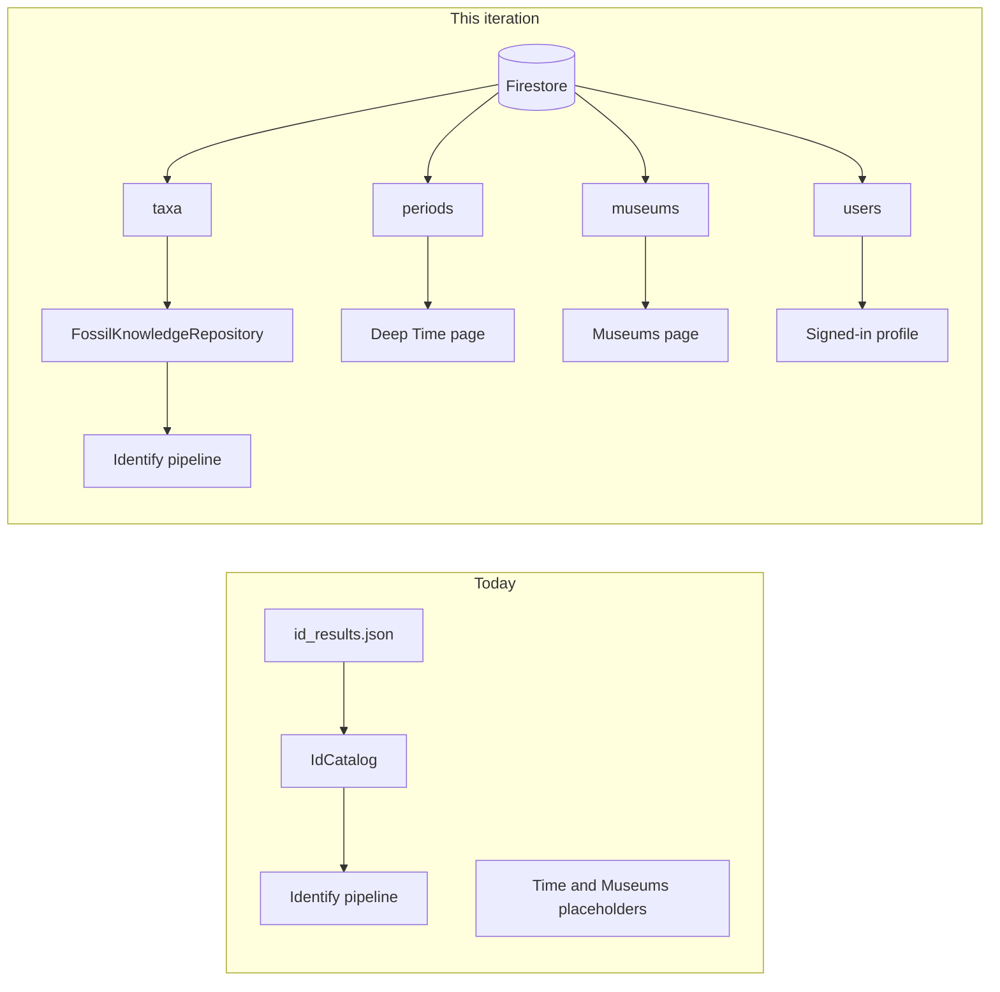
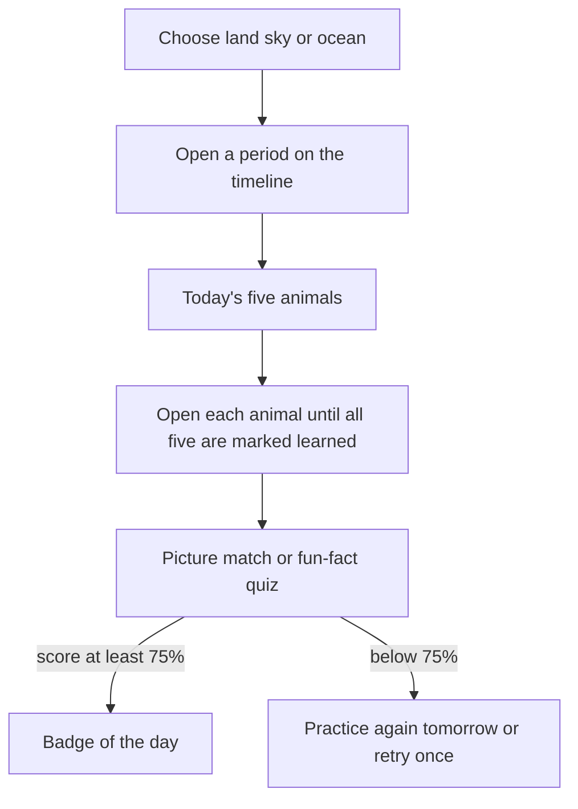
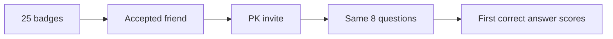

# Iteration 8 — Firestore, Deep Time & Museums

Plan for the next build after [Iteration 7](./iteration-7-identify-roadmap.md). This iteration adds **Cloud Firestore** as Strata’s shared database: account profiles, and a curated fossil-knowledge catalog the Identify algorithms can read. It also replaces the **Deep Time** and **Museums** placeholders with basic, data-backed pages.

**Kids Mode** is specified here so the database can hold it later. It continues in the same build-order table, after the v1.0 milestone. See [Kids Mode](#kids-mode-after-accounts).

**Build order:** 0.1 → … → 1.0 → K0.1 → … → K1.0  
Each version adds **one feature**, is **tested**, and **builds on** the previous version. The full list is the [build-order table](#build-order).

---


## Goal

Ship a demoable slice:

1. The app talks to a Firebase project (Auth + Firestore) and still runs if the network is down, using the current local JSON.
2. Firestore holds **user profiles** and a **taxon catalog** (`taxa`) that Identify, species facts, Deep Time, and (later) Kids Mode all read.
3. **Deep Time** (`/timeline`) lists geological periods and shows iconic taxa for the one you tap.
4. **Museums** (`/museums`) lists researched local museums, links what they hold to `taxa`, and opens a detail page. This is the last feature before v1.0 because it starts with research.


## Leave for later

- Kids accounts, Kids Mode screens, daily sets, quizzes, badges, friends, and PK — designed below, built after accounts
- Dig Map / Camp Prep
- Live museum search (Places API) and device location
- Full species-profile rewrite (pages may link to the existing profile)
- Replacing the Paleobiology Database (PBDB) double-check
- Iteration 7 leftovers (v0.7 capture reliability onward) — finish those on the Identify roadmap; this plan does not restart them

---


## Current starting point


| Piece                     | Location today                                              |
| ------------------------- | ----------------------------------------------------------- |
| Bottom nav Time / Museums | `ShellPlaceholderTab` on `/timeline` and `/museums`         |
| Identify catalog          | `IdCatalog` ← `assets/data/id_results.json`                 |
| Identify pipeline         | `GeminiIdentifyRepository` + heuristics + PBDB double-check |
| Recent fossils            | `MockFossilRepository`                                      |
| Sign in                   | Onboarding link is UI only                                  |
| Auth / database           | None                                                        |





Keep repository interfaces. Screens read repositories. Firestore is one implementation; bundled JSON stays the offline fallback.

---


## Firestore collections

Client config comes from FlutterFire (`flutterfire configure`). Do not commit service-account keys or the Gemini key. Firebase client config files may live in the platform folders.

### `users/{uid}`

Created the first time someone signs in. Kid-only fields stay unused until Kids Mode.


| Field         | Type                   | Purpose                                                  |
| ------------- | ---------------------- | -------------------------------------------------------- |
| `displayName` | string                 | Home greeting. Replaces the hardcoded “Betty”.           |
| `accountKind` | `"standard"` | `"kid"` | Defaults to `standard`.                                  |
| `createdAt`   | timestamp              |                                                          |
| `badgeCount`  | number                 | Denormalized count for the later PK gate. Stays `0` now. |
| `friendCode`  | string                 | Short code for later friend requests.                    |


Subcollections reserved now, written later:

- `users/{uid}/badges/{badgeId}`
- `users/{uid}/progress/{setKey}`
- `users/{uid}/identifications/{id}` — optional home for recent IDs after Iteration 7 v0.8


### `taxa/{id}` — fossil knowledge

One document per genus (or a clearly labeled higher group). This is the catalog algorithms and explore pages share. Seed it from today’s `id_results.json` genera, then add the Cretaceous demo set even if Identify does not use every one yet:

*Triceratops*, *Velociraptor*, *Tyrannosaurus*, *Pachycephalosaurus*, *Ankylosaurus*.


| Field                     | Type                           | Used by                                               |
| ------------------------- | ------------------------------ | ----------------------------------------------------- |
| `scientificName`          | string                         | All                                                   |
| `commonName`              | string                         | Timeline, kids cards                                  |
| `commonGroup`             | string                         | Identify cards (“Ammonite”, “Dromaeosaurid”)          |
| `family`                  | string                         | Identify                                              |
| `taxonomy`                | string[]                       | Identify + profile                                    |
| `realm`                   | `"land"` | `"sky"` | `"ocean"` | Kids explorer. Sky covers pterosaurs and early birds. |
| `periodIds`               | string[]                       | Timeline filter, daily sets                           |
| `ageStartMa` / `ageEndMa` | number                         | Facts, timeline label                                 |
| `facts`                   | `{icon, value, label}[]`       | Same shape as `TaxonFact`                             |
| `funFacts`                | string[]                       | Kids quiz. Short, curated sentences.                  |
| `tip`                     | string                         | Identify tip                                          |
| `imageAsset`              | string                         | Bundled art path                                      |
| `useInIdentify`           | bool                           | Algorithms ignore docs with `false`                   |
| `kidSafe`                 | bool                           | Daily sets only include `true`                        |
| `iconic`                  | bool                           | Timeline “iconic for this period” row                 |


Identify keeps PBDB as an external double-check. Firestore does not invent confidence scores.

### `periods/{id}`

Phanerozoic periods only for this iteration (Cambrian through Quaternary). Each doc: `name`, `era` (`Paleozoic` | `Mesozoic` | `Cenozoic`), `startMa`, `endMa`, `blurb`, `order`.

### `museums/{id}` — added in v0.8

About 6–10 local museums chosen in the v0.7 research step.


| Field                    | Type                  | Purpose                                                                                                   |
| ------------------------ | --------------------- | --------------------------------------------------------------------------------------------------------- |
| `name`, `city`, `region` | string                | List card and filter                                                                                      |
| `focus`, `blurb`         | string                | Card subtitle, detail intro                                                                               |
| `website`                | string                | Link out from detail                                                                                      |
| `imageAsset`             | string                | Bundled image                                                                                             |
| `highlights`             | string[]              | Short lines on the detail page                                                                            |
| `taxonIds`               | string[]              | Matched `taxa` ids, so “which museums have *Triceratops*?” is one `array-contains` query                  |
| `sources`                | `{name, url, kind}[]` | Where the holdings came from (`collectionPortal`, `idigbio`, `gbif`, `pbdb`, `exhibitPage`, `staffEmail`) |
| `lastVerified`           | timestamp             | When someone last checked the sources                                                                     |


### `museums/{id}/holdings/{taxonId}` — added in v0.8

One doc per matched taxon at that museum: `taxonId`, `sourceName` (the name exactly as the source wrote it), `onDisplay` (bool; `false` means collection-only or unknown), `source`, `note`.

### `redListSpecies/{id}` — schema only this iteration

Living species for the future At Risk page and the kids red-list track. Keep them **out of** `taxa` so Identify cannot match a photo to a living red-list animal. Fields to reserve: `commonName`, `scientificName`, `status`, `habitat`, `threats` (short strings), `funFacts`, `imageAsset`, `kidSafe`.

---


## How algorithms use `taxa`

Add `FossilKnowledgeRepository`:

- `watch` / `getTaxon(id)`
- `taxaForIdentify()` — `useInIdentify == true`
- `iconicForPeriod(periodId)`
- `kidPool(realm, periodId)` — used later; implement the query in this iteration so the shape is real

`IdCatalog.load` stays the offline source. When Firestore returns identify taxa, merge by genus:

- Local JSON fills any genus the cloud copy is missing (thumbnails, tips).
- Cloud `facts`, `taxonomy`, `family`, and `commonGroup` override when present.
- Heuristics and the Gemini repository keep their current method signatures and call the merged catalog.

If Firestore errors or the user is offline, Identify behaves exactly as it does at the end of Iteration 7.

---


## Deep Time page

Replace the `/timeline` placeholder. Bottom nav stays put.

**Period list**

- Title: Deep Time
- Three era chips: Paleozoic, Mesozoic, Cenozoic. Mesozoic starts selected.
- Rows for that era’s periods: name, age range in millions of years, up to three iconic thumbnails from `taxa` where `iconic` and `periodIds` contains the period.

**Period detail** — push `/timeline/:periodId`

- Period name, age range, one-sentence `blurb`
- Grid of iconic taxa (image, common name, realm chip)
- Tap a taxon with a genus → existing `/species/:genus`

Empty cloud results fall back to a small bundled period list so the tab is never a blank error.

## Museums

Museums come last before v1.0 and take three versions: research, data linking, then the pages.

### Research (v0.7)

Pick 6–10 museums in our area. For each one, find a way to learn what fossils it has:

- **The museum’s own online collection portal**, if it has one (search, download, or API)
- **iDigBio** and **GBIF** specimen records, filtered by the museum’s institution code and fossil specimens
- **PBDB** collection records that cite the museum’s specimen numbers
- **Exhibit pages, floor guides, or press pages** for what is actually on display
- **Emailing collections or education staff** when nothing public exists

Record the findings in `docs/museum-research.md`, with one row per museum: name, city, website, sources found, how the data comes out (API, download, or manual), and whether it tells you **on display** or only **in the collection**. Note any terms of use on the source.

### Data and linking (v0.8)

- Turn the research into `museums` docs and `holdings` subcollections
- Normalize each source name to a genus (trim species, fix case, drop “cf.” and “sp.”), then match against `taxa`
- A matched genus becomes a `holdings` doc plus an entry in `taxonIds`
- An unmatched genus goes into an unmatched report. Either add it to `taxa` with `useInIdentify: false`, or leave it out on purpose.
- Ship a bundled `assets/data/museums.json` fallback with the same shape


### Pages (v0.9)

Replace the `/museums` placeholder.

**List**

- Title: Museums
- Text filter on name and city (in memory, the list is small)
- Card: image, name, city, `focus`

**Detail** — push `/museums/:museumId`

- Name, city, blurb, website link
- Highlight lines
- Taxon chips in two groups, **On display** and **In collection**, linking to `/species/:genus` when the genus resolves
- Source credits with `lastVerified`

No map and no “near you” sorting in this iteration.

---


## Access rules


| Path                                                                 | Read               | Write                                                                                      |
| -------------------------------------------------------------------- | ------------------ | ------------------------------------------------------------------------------------------ |
| `taxa`, `periods`, `museums`, `museums/*/holdings`, `redListSpecies` | Any signed-in user | Nobody from the app (seed with a script or the console)                                    |
| `users/{uid}`                                                        | That user          | That user, and only `displayName` after creation                                           |
| `accountKind`, `badgeCount`, `friendCode`                            | That user          | Client cannot change these (set by trusted writes later; `accountKind` defaults at create) |


Until Auth ships in v0.4, v0.2–v0.3 may use a locked-down dev ruleset on a non-production project. v0.4 flips rules to the table above. Catalog content is not user-writable.

---


## Build order

Work top to bottom. Museums (v0.7–v0.9) sit last before v1.0 because they start with research. v1.0 is the Firestore, Deep Time, and Museums milestone. K0.1 starts Kids Mode after that.


| Version  | Feature                                   | Builds on       | Tests                                                | Done when                                                                                                           |
| -------- | ----------------------------------------- | --------------- | ---------------------------------------------------- | ------------------------------------------------------------------------------------------------------------------- |
| **0.1**  | Firebase bootstrap                        | Iteration 7 app | App boots with and without a Firebase project file   | `StrataServices` can construct Firebase when configured                                                             |
| **0.2**  | `taxa` + periods schema and seed          | v0.1            | Unit: JSON ↔ model, merge with `IdCatalog`           | Cretaceous land genera exist as taxon docs                                                                          |
| **0.3**  | Knowledge repository in the Identify path | v0.2            | Unit: offline fallback + cloud override              | Identify still returns the same shape of result                                                                     |
| **0.4**  | Accounts                                  | v0.3            | Widget: signed-out vs signed-in greeting             | Onboarding Sign in creates `users/{uid}`                                                                            |
| **0.5**  | Deep Time list + period detail            | v0.4            | Widget: era chip filters periods                     | `/timeline` is no longer “Coming soon”                                                                              |
| **0.6**  | Rules and failure states                  | v0.5            | Rules unit/emulator if available; widget error state | Offline JSON path still identifies; client cannot write `taxa`                                                      |
| **0.7**  | Museum research                           | v0.6            | Review: every museum has at least one source         | `docs/museum-research.md` covers 6–10 local museums with sources and sample taxa                                    |
| **0.8**  | Museum data + link to `taxa`              | v0.7            | Unit: name normalizer + matcher; fallback JSON loads | Every holding is matched to `taxa` or listed in the unmatched report                                                |
| **0.9**  | Museums list + detail pages               | v0.8            | Widget: filter + open detail                         | `/museums` opens a researched museum with linked taxa                                                               |
| **1.0**  | Milestone: Firestore, Deep Time, Museums  | v0.9            | `flutter test` plus a short demo script              | Firestore catalog, sign-in, Deep Time, Museums                                                                      |
| **K0.1** | Kid account + kids shell                  | v1.0            | Widget: kid sign-in route                            | Signing into a kid account opens Kids home, not adult Home                                                          |
| **K0.2** | Introduction gallery                      | K0.1            | Widget: chapter order                                | Swiping shows the drawing chapters in order                                                                         |
| **K0.3** | Realm → period → daily five               | K0.2            | Unit: daily-five pick is stable for a date           | Land + Cretaceous shows the five named dinosaurs for the day                                                        |
| **K0.4** | Learn flags + quiz + paleo badge          | K0.3            | Unit: ≥ 75% awards once; below 75% does not          | A passing quiz writes one `{date}_paleo` badge                                                                      |
| **K0.5** | Red list daily five + badge               | K0.4            | Unit: red-list badge id is separate                  | A second track can award `{date}_redList`                                                                           |
| **K0.6** | Badge case                                | K0.5            | Unit: `badgeCount` matches badge docs                | Count on the profile matches badge documents                                                                        |
| **K0.7** | Friends                                   | K0.6            | Widget: accept and decline                           | A declined request never starts a match                                                                             |
| **K0.8** | PK                                        | K0.7            | Unit: gate at 25; faster correct answer scores       | Under 25 badges PK stays locked; at 25 a friend race scores the first correct answer                                |
| **K1.0** | Milestone: Kids Mode                      | K0.8            | Demo script                                          | Intro → land → Cretaceous → learn five → pass quiz → badge; a second account friends and races only after 25 badges |

```mermaid
flowchart LR
  v01[v0.1 Firebase] --> v02[v0.2 Schema and seed]
  v02 --> v03[v0.3 Algorithm read path]
  v03 --> v04[v0.4 Accounts]
  v04 --> v05[v0.5 Deep Time]
  v05 --> v06[v0.6 Rules]
  v06 --> v07[v0.7 Museum research]
  v07 --> v08[v0.8 Museum data and links]
  v08 --> v09[v0.9 Museum pages]
  v09 --> v10[v1.0 Milestone]
  v10 --> k01[K0.1 Kid account]
  k01 --> k02[K0.2 Intro gallery]
  k02 --> k03[K0.3 Daily five]
  k03 --> k04[K0.4 Quiz and badge]
  k04 --> k05[K0.5 Red list]
  k05 --> k06[K0.6 Badge case]
  k06 --> k07[K0.7 Friends]
  k07 --> k08[K0.8 PK]
  k08 --> k10[K1.0 Kids milestone]
```





### Version 0.1 — Firebase bootstrap

- Add `firebase_core`, `firebase_auth`, `cloud_firestore`
- Run FlutterFire and document the setup commands in this file’s runbook (project id, platforms you actually build)
- Initialize Firebase in `main` when config exists; if it does not, skip and keep local repositories
- Add gitignore entries for service-account JSON

**Done when:** a configured build reaches Home, and a build without Firebase config still reaches Home.

### Version 0.2 — Schema and seed

- Dart models for taxon, period, user profile, red-list species (museum models wait for v0.8)
- Seed script or documented console import for periods and taxa converted from `id_results.json` plus the five Cretaceous land genera
- Bundled fallback JSON for periods (small file under `assets/data/`)

**Done when:** a test loads the fallback and maps genus names the Identify catalog already knows.

### Version 0.3 — Algorithm read path

- `FossilKnowledgeRepository` with Firestore and asset implementations
- Merge into the catalog `GeminiIdentifyRepository` already uses
- Do not change confidence rules in this version

**Done when:** with Firestore empty or offline, Identify matches today’s behavior; with a cloud taxon, fact fields come from that doc.

### Version 0.4 — Accounts

- Email/password sign up and sign in from the onboarding Sign in entry
- On first sign-in, create `users/{uid}` with `accountKind: standard`, `badgeCount: 0`, and a generated `friendCode`
- Home greeting uses `displayName` (ask once if blank; suggested default from the email prefix)
- Sign out returns to onboarding
- No kid-account control yet

**Done when:** a new account appears in `users` and Home shows that name.

### Version 0.5 — Deep Time

- New screens under `dino_app/lib/screens/timeline/`
- Routes `/timeline` and `/timeline/:periodId` inside the existing shell branch
- Data from `FossilKnowledgeRepository` / a small `PeriodRepository`

**Done when:** Mesozoic → Cretaceous shows the five seeded land genera among the iconic taxa.

### Version 0.6 — Rules and failure states

- Apply the access table, including the `museums` paths ahead of time
- Deep Time shows the bundled periods with a quiet retry when the read fails
- Confirm the client cannot write `taxa`

**Done when:** airplane mode still opens Deep Time from the bundle, and Identify still completes on the local catalog.

### Version 0.7 — Museum research

No app code. See [Research](#research-v07).

- Choose 6–10 museums in our area
- For each, check the collection portal, iDigBio, GBIF, PBDB, exhibit pages, and staff contacts
- Write `docs/museum-research.md` with sources, how data comes out, on-display vs collection, and terms of use
- List a few sample genera per museum

**Done when:** every chosen museum has at least one usable source, and the doc says which museums have no public data.

### Version 0.8 — Museum data and linking

See [Data and linking](#data-and-linking-v08).

- Museum and holding models, plus `MuseumRepository` with Firestore and asset implementations
- Seed `museums` and `holdings` from the research
- Name normalizer and matcher against `taxa`; write the unmatched report
- Bundled `assets/data/museums.json` fallback

**Done when:** every holding resolves to a `taxa` doc or appears in the unmatched report, and an `array-contains` query for a seeded genus returns its museums.

### Version 0.9 — Museum pages

See [Pages](#pages-v09).

- Screens under `dino_app/lib/screens/museums/`
- Routes `/museums` and `/museums/:museumId`
- On-display and in-collection chips reuse the species route
- Falls back to the bundled museums when the read fails

**Done when:** filtering by a city substring leaves the matching museum, and its detail page shows linked taxa and source credits.

### Version 1.0 — Milestone

Demo script:

1. Sign in
2. Open Deep Time, Mesozoic, Cretaceous, tap *Triceratops* through to the species profile if that genus resolves
3. Open Museums, open one museum, tap an on-display taxon
4. Run Identify once online (cloud taxon facts) and once with Firebase disabled (local catalog)

---


## Kids Mode (after accounts)

Build this only after **v1.0** in the [build-order table](#build-order). It is a **separate kid account**, not a switch on a standard account. Signing into that account opens the kids shell.

The point of the mode is to get kids interested in paleontology: drawn introductions, a small set of animals to learn, a short quiz, a badge, and only then a race against a friend.

### Kid account

- Create from a signed-out screen: display name, username, password
- `users/{uid}.accountKind = "kid"` (set by a trusted create path, not by the client editing the field afterward)
- Signing into a kid account routes to `/kids` instead of adult Home
- Standard accounts keep today’s shell (Home, Map, Time, Museums)


### Kids home

Four sections:

1. **Introduction** — swipeable pages of the dinosaur drawings, in reading order
2. **Explore** — realm, then the paleo timeline, then today’s five animals
3. **Red List** — the same memorize → quiz → badge loop for living at-risk species
4. **Badges** — collection, friend code, and PK when `badgeCount >= 25`

Drawings ship as app assets (`assets/images/kids/intro/`). An `introChapters` list (bundled, optionally mirrored in Firestore) stores order, caption, and asset path. Adding a drawing means dropping a file in and appending one chapter. No upload flow.

### Explore loop




1. The kid picks a realm: **Land**, **Sky**, or **Ocean**.
2. They see the same periods as Deep Time, filtered to that realm (a period with zero `kidSafe` taxa in that realm is visible but not playable).
3. Opening a period loads **five animals for the day**. The set is deterministic: shuffle `taxa` where `kidSafe`, `realm`, and `periodIds` match, using a seed of `local date + realm + periodId`, then take five. Every kid gets the same five for that combination on that date.
4. Worked example — Land + Cretaceous, once those five are the whole playable pool (or the seeded head of the pool): *Triceratops*, *Velociraptor*, *Tyrannosaurus*, *Pachycephalosaurus*, *Ankylosaurus*.
5. Each animal card shows the picture, name, realm, period, and two or three `funFacts`. Marking it learned writes `users/{uid}/progress/{yyyy-MM-dd_realm_period}` with the taxon ids learned.
6. The quiz unlocks when all five are learned. It mixes two question kinds, all from those five animals:
  - Picture → pick the name (four choices)
  - Fun fact → pick which animal it describes
7. About eight questions. **Score ≥ 75%** (at least 6 of 8) awards the badge. Below that, they can retry once the same day; a second miss waits until the next day’s set.
8. The badge is one illustrated paleo badge for that calendar day and track. Art rotates from a small bundled set (`assets/images/kids/badges/`). Badge doc id is `{yyyy-MM-dd}_paleo`, so the same day cannot award two paleo badges.


### Red list loop

Same steps, with `redListSpecies` where `kidSafe` is true. The kid does not pick a geological period; they get five living species for the day (seed `local date + "redList"`). Quiz and **≥ 75%** rule match the paleo loop. Badge doc id is `{yyyy-MM-dd}_redList`. Copy stays short and concrete (where it lives, one reason it is at risk) and avoids graphic harm.

`badgeCount` is the number of badge documents. Paleo days and red-list days both count.

### Friends

- Kids exchange `friendCode` in person
- A request creates `friendships/{id}` with `users: [uidA, uidB]`, `requestedBy`, `status: pending | accepted | declined`
- Both kids can read the friendship; only the recipient can accept
- No chat


### PK mode

Unlocked when `badgeCount >= 25`. The gate is there so both kids have already learned a batch of animals before they race.

- From an accepted friend, send a PK invite
- `matches/{id}`: `players`, `status` (`invited` | `active` | `finished`), `questions` (8, drawn from `funFacts` and picture prompts on `kidSafe` taxa and red-list species), `scores`
- Each answer is a subdocument the answering kid writes once: choice + client tap time. The server timestamp decides who was first.
- **First correct answer takes the point.** A wrong answer does not block the friend. If both are wrong, the question scores nothing.
- Higher score wins. A tie breaks to the kid with the faster correct answers (sum of server timestamps).
- Questions are fixed when the match starts so both kids see the same list.




### Kids safety constraints

- Kid profiles store a display name, username, and friend code. No email requirement on the kid account in v1 of this phase.
- Friend requests need the other kid’s code and an accept tap.
- PK has no free-text answers and no chat.
- Quiz and badge text come from the curated catalog, not from other users.
- `taxa` and `redListSpecies` stay read-only to every account.

### Kids data (added when that phase starts)


| Path                                    | Holds                                        |
| --------------------------------------- | -------------------------------------------- |
| `users/{uid}/progress/{setKey}`         | Learned taxon ids, quiz attempts, best score |
| `users/{uid}/badges/{yyyy-MM-dd_track}` | Art id, score, set key, earned time          |
| `friendships/{id}`                      | The pair and status                          |
| `matches/{id}`                          | Questions, status, scores                    |
| `matches/{id}/answers/{uid_question}`   | One shot per kid per question                |


Kid versions are **K0.1 through K1.0** in the [build-order table](#build-order). They start after the v1.0 milestone.

---

## Runbook (v0.1)

The app boots **with or without** FlutterFire config. On a platform `lib/firebase_options.dart` does not cover, `StrataServices` skips Firebase and keeps the local JSON repositories.

Use a **non-production** Firebase project for this iteration (Auth + Firestore). Do not commit service-account keys or the Gemini key. Client files (`google-services.json`, generated `firebase_options.dart`, `firebase.json`) are committed; they hold public client ids, not secrets.

```text
# One-time tooling
npm install -g firebase-tools
firebase login
dart pub global activate flutterfire_cli

# From dino_app/, with the Firebase CLI logged in:
flutterfire configure --project=dino-app-90aa2
# Platforms: android, ios, web.
# This overwrites lib/firebase_options.dart and android/app/google-services.json,
# and adds the google-services Gradle plugin.

flutter run -d chrome
```

**Project id:** `dino-app-90aa2` (Firestore location: United States).

**Platforms configured:** Android, iOS, web. Windows, macOS, and Linux desktop builds are not configured, so they skip Firebase and run on local JSON. Re-run `flutterfire configure` and add a platform if we start building for it.

**Console setup:** enable the Email/Password provider under Authentication before v0.4. Until v0.6 applies the access table, keep Firestore rules locked down (deny all, or signed-in reads only).

**Check it worked:** the debug console prints `StrataServices: Firebase initialized (dino-app-90aa2)` on startup. On Windows desktop it prints `Firebase options missing` instead, which is the expected skip path.

Seed content (v0.2+) is imported with a local script that uses a service-account file kept **outside** the repo (`*-firebase-adminsdk-*.json` is gitignored). The app never embeds that file.

The skip path is covered by `test/firebase_bootstrap_test.dart`, which forces an unconfigured platform.

## Demo taxa that must exist before Kids K0.3


| Realm | Period     | Animals                                                                    |
| ----- | ---------- | -------------------------------------------------------------------------- |
| Land  | Cretaceous | Triceratops, Velociraptor, Tyrannosaurus, Pachycephalosaurus, Ankylosaurus |


Sky and ocean pools can start smaller and grow. A period with fewer than five `kidSafe` taxa shows the ones it has and keeps the quiz locked until the pool reaches five.

